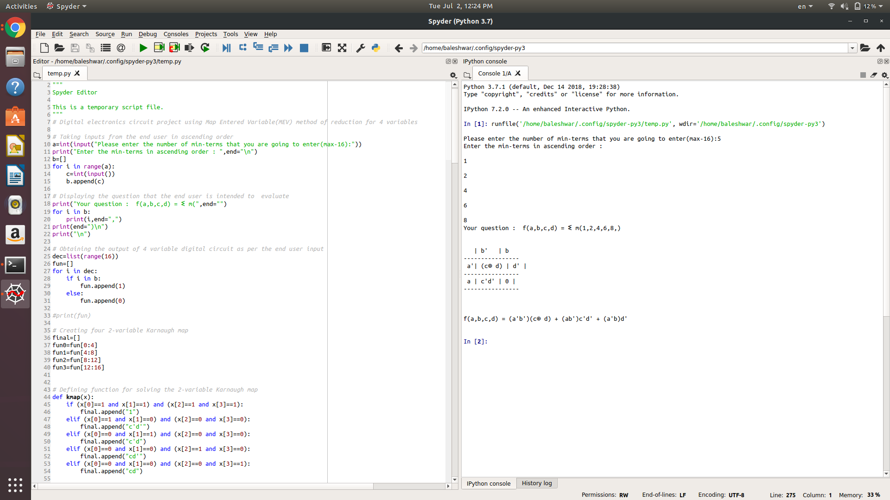

# Python 3 implementation of Map Entered Variable(MEV) method

## What is Map Entered Variable(MEV) method ?
K-map is the best manual technique for the simplification of Boolean
equations, but it becomes difficult to manage when number of variable
exceed 5 or 6. So a technique called map entered variable (MEV) is used
to decrease the effective size of k-map. It allows a smaller map to handle a
large number of variables.

Let m denotes number of squares in K-map and let n be the number of
variables then ,
m = 2^n .........for conventional K-map

If we use the MEV then the number of squares ( m ) will be reduced. MEV
K-map allows us a single variable (A ,B, C,etc) or a complete switching
expression (such as A+B’ C) into a cell , in addition to 0s , 1s, and don’t
care terms.

An entered variable k-map is shown in figure :

The Boolean function obtained by solving the given K-map manually is given below -
f = A!B + !BC

At first , it may look fairly simple as a relatively simple example has been demonstrated for the simplicity of understanding .
As the number of variables increases the complexicity of grouping the enterd variables also increases .
The code in this case is written for four variable K-map problem , which means there will be 16 cells in the K-map for that kind of problems .
 

## The Python 3 code in action 

(Using terminal in Ubuntu 18.04 )

-----------------------------------------------------------------------------------------------------------------------------

(Using Spyder IDE in Ubuntu 18.04)

## How to run the code and get your desired results
It's fairly simple .
All you need is a text editor and terminal (in case of Linux or Mac ) or any IDE like PyCharm or Spyder,etc .

The next step , just copy and paste the raw version of project.py code present in the main page of mev-project .

In case you are using Mac or Linux for testing this code and have  saved the code in your system as project.py ,then open the terminal and move to the directory where you have saved the project.py and type as below to run it

$ python3 project.py

If you are using any IDE in Windows or Mac , simply run the code using the " Run " button available in the IDE .

To get the desired result , enter any number between 1 and 16 (including both) and then enter that many number of terms in ascending order as shown in the screenshot above .

The detailed description about the project can be found in the link below :

https://drive.google.com/file/d/1oAODZIsy7459-_C6LWzd1m9FnZfv9eqy/view?usp=drivesdk
