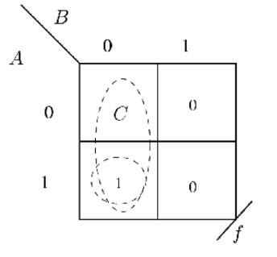
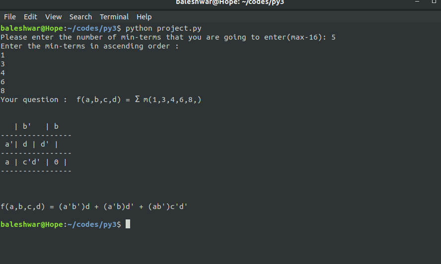

# Python 3 implementation of Map Entered Variable(MEV) method

## What is Map Entered Variable(MEV) method ?

K-map is the best manual technique for the simplification of Boolean
equations, but it becomes difficult to manage when number of variable
exceed 5 or 6. So a technique called map entered variable (MEV) is used
to decrease the effective size of k-map. It allows a smaller map to handle a
large number of variables.

Let m denotes number of squares in K-map and let n be the number of
variables then ,
m = 2^n .........for conventional K-map

If we use the MEV then the number of squares ( m ) will be reduced. MEV
K-map allows us a single variable (A ,B, C,etc) or a complete switching
expression (such as A+B’ C) into a cell , in addition to 0s , 1s, and don’t
care terms.

An entered variable k-map is shown in figure below :

 

## The Python 3 code in action 

The detailed description about the project can be found in the link below :

https://drive.google.com/file/d/1oAODZIsy7459-_C6LWzd1m9FnZfv9eqy/view?usp=drivesdk
